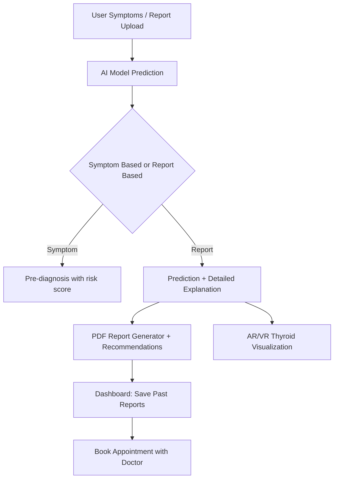

# 🧾 ThyroVaidya – AI + AR/VR Thyroid Health Assistant  

> 🧠 **ThyroVaidya** is a **Full-stack AI + ML + AR/VR project** built to help patients **understand, predict, and manage thyroid health** with confidence. It blends **AI-powered screening**, **medical report analysis**, and **personalized doctor guidance** into one platform.  Additionally, it offers **3D thyroid visualization** and a **detailed Kolhapur district thyroid health case study**.  

---

## 🌟 Project Overview  

ThyroVaidya is an **AI-driven healthcare assistant** designed for **patients, doctors, and researchers** to better manage and study **thyroid disorders**.  

Unlike traditional systems, ThyroVaidya provides:  
- 🔍 **Symptom-based Pre-diagnosis (AI)** – early screening from patient symptoms  
- 📑 **Report-based Analysis (AI + ML)** – enter or upload lab reports for detailed insights  
- 📊 **Personalized Dashboard & Appointments** – manage past reports, track health, and book doctors  
- 🏥 **Kolhapur Case Study & Local Doctor Network** – real-world district-level health insights  
- 🌀 **3D AR/VR Thyroid Visualization** – immersive gland-level understanding  
- 🤖 **GenAI Recommendations** – lifestyle, diet, and exercise suggestions explained in natural language  

💡 **Why it matters:**  
ThyroVaidya acts like a **virtual medical advisor**, giving **clear, human-friendly explanations** so patients don’t panic and feel guided at every step of their thyroid care journey.  

---

## 🔬 Why Thyroid Matters?  

The **thyroid gland** plays a key role in controlling metabolism, energy, and body balance.  
When it doesn’t function properly, it leads to disorders like:  
- **Hyperthyroidism** → thyroid works too fast (weight loss, anxiety, fast heartbeat)  
- **Hypothyroidism** → thyroid works too slow (tiredness, weight gain, cold sensitivity)  
- **Subclinical Disorders** → mild imbalances, often without symptoms  

ThyroVaidya helps in **early detection, patient awareness, and continuous monitoring**.  

---

## 🚀 Key Features  

### 🔹 1. Symptom-Based Pre-Diagnosis  
- AI model that predicts **possible thyroid issues** from symptoms like fatigue, weight changes, or mood swings.  
- Provides **probability-based risk score**.  
- Helps patients **take action early** before test results.  

### 🔹 2. Report-Based Analysis  
- Upload medical reports or manually enter **T3, T4, TSH** values.  
- AI model classifies into:  
  - Hyperthyroidism  
  - Primary Hypothyroidism  
  - Secondary Hypothyroidism  
  - Subclinical Hypo/Hyperthyroidism  
  - Normal  
- Generates **detailed explanations** in simple language.  
- Explains:  
  - Why the disorder occurs  
  - Gland-level changes  
  - Common causes  
  - Lifestyle impact  
  - **Personalized management tips**  

### 🔹 3. Personalized Dashboard  
- Stores **past reports**  
- Tracks **progress over time**  
- Allows **appointment booking** with doctors  

### 🔹 4. Kolhapur Case Study (Research)  
- Regional analysis of **thyroid patients in Kolhapur district**  
- Insights on **age, gender, and lifestyle patterns**  
- Provides **local doctor recommendations** for follow-up care  

### 🔹 5. AR/VR 3D Thyroid Visualization  
- Interactive **3D thyroid gland model**  
- Helps patients **visualize how the gland works**  
- Great for **education, awareness, and medical training**  

### 🔹 6. GenAI Recommendations  
- **Diet advice** (foods to prefer/avoid)  
- **Exercise suggestions** (simple daily routines)  
- **Wellness guidance** to balance thyroid health  

---

## 🏗️ System Workflow  

---

## ⚙️ Tech Stack  

- **Frontend**: HTML5, CSS3, Bootstrap, Tailwind  
- **Backend**: Django (Python)  
- **Database**: SQLite (User Reports, Doctors, Appointments)  
- **AI/ML Models**:  
  - Symptom-based classifier (pre-diagnosis)  
  - Report-based thyroid predictor (T3, T4, TSH)  
- **GenAI**: For natural-language explanations & recommendations  
- **AR/VR**: 3D Thyroid visualization  
- **PDF Reports**: ReportLab  

---

## 📸 Screenshots  

| Home | About | Dashboard | Doctors |
|------|-------|-----------|---------|
|  |  |  |  |

| Appointment | Report Form | Upload PDF | Report Analysis |
|-------------|-------------|------------|----------------|
|  |  |  |  |

| Report Result | Symptom Form | Symptom Result | Recommendations |
|---------------|--------------|----------------|-----------------|
|  |  |  |  |

| Generated Report | 3D Section | VR Model | Research |
|------------------|------------|----------|----------|
|  |  |  |  |

---

## 📊 Example Case Study – Kolhapur  

### 📍 Kolhapur District Thyroid Health Insights  
- High prevalence of **hypothyroidism** among middle-aged people.  
- Increasing **subclinical thyroid cases** in young adults due to lifestyle factors  
- **Delayed diagnosis** in rural areas due to lack of awareness  
- **ThyroVaidya aims to bridge this gap** with AI-powered pre-screening and doctor network  

---

## 📈 Future Enhancements  

- 📊 Thyroid trend graphs over time  
- 📲 Mobile app integration  
- 🧠 Advanced LLM medical chatbot  
- 🌍 Expand research datasets to other districts  

---

## ⭐ Support  

If you find this project helpful, please ⭐ star this repo and share it with others.  
Together we can improve thyroid awareness and patient care.  

---

⚡ *ThyroVaidya explains results in simple words, adds doctor guidance, uses AI for predictions, and AR/VR for thyroid learning.*  
